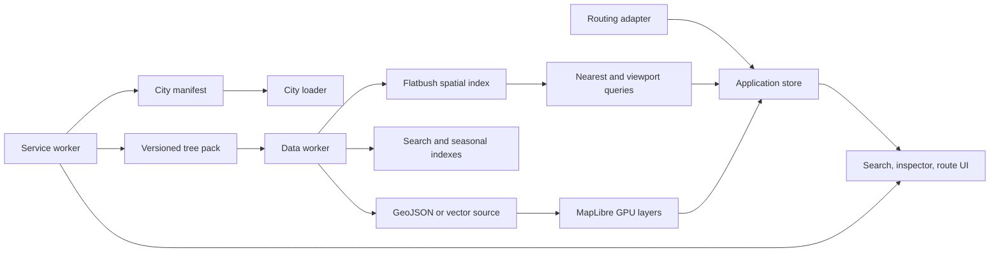

# Urban Canopy Engine v2: Architecture and Implementation

Run this document only after the design phase in `2026-07-11-v2-01-design-brainstorm.md` has been completed and approved.

## Prompt 2: Run the architecture and implementation phase

```text
You are a Principal Software Architect and senior implementation engineer. Work in the existing Vancouver Interactive Tree Map repository.

The standalone v2 design phase has already been completed. Read PRODUCT.md, DESIGN.md, every required document under docs/design/, and docs/plans/2026-07-11-v2-02-engine-overhaul.md before changing production code. Treat the approved design artifacts as binding constraints.

Implement the Urban Canopy Engine v2 sequentially using the numbered plan in this document. Preserve the existing working application until each replacement path is tested. Do not skip acceptance criteria, combine unrelated tasks, or introduce Vancouver-specific conditionals into generic engine modules.

Priorities are: GPU-rendered MapLibre layers instead of DOM markers, worker-backed city data and spatial search, explicit state and provider boundaries, reliable routing and viewport requests, responsive accessible UI matching the approved design, bounded offline PWA behavior, generic city-pack tooling, complete verification, and top-tier open-source documentation.

After each numbered task, run the relevant unit, integration, browser, accessibility, build, and performance checks. Record material architectural decisions under docs/adr/. Stop and report if an approved design requirement conflicts with performance, accessibility, data licensing, or browser capabilities.

Experimental phenology, shade routing, passport, observations, and camera identification must remain behind city manifest capability flags. Do not claim that online routing or the entire basemap works offline unless it actually does.

Finish only when all release gates in Task 20 pass. Provide a concise completion report with changed paths, measured performance against the v1 baseline, remaining risks, and exact verification commands.
```

## Phase 1: Extreme Performance Audit

### Verified v1 baseline

- Dataset: 10,000 trees, 49 species, 608 KB raw JSON.
- Production JavaScript: 624.38 KB, 177.26 KB gzip.
- CSS: 7.63 KB, 2.09 KB gzip.
- Automated tests: 4 suites and 5 tests, all passing.
- Local production build: 372 ms.
- MapLibre is loaded separately from unpkg and is not included in the reported JavaScript bundle.

### Highest-impact findings

| Priority | Finding | Impact | Resolution |
|---|---|---|---|
| Critical | Every tree is a `maplibregl.Marker` with a DOM element and listener | Thousands of elements, layout work, memory pressure, poor map interaction | Replace tree markers with a GeoJSON source and GPU circle/symbol layers |
| Critical | Filtering reconstructs all 10,000 tree objects | Allocation and garbage-collection spikes | Decode once and use MapLibre filters or indexed worker queries |
| Critical | Filter changes remove and recreate every marker | Large main-thread stalls | Keep one source and update layer filters |
| High | Dataset is imported into application JavaScript | Code and city data cannot be cached or updated independently | Fetch a separately versioned city pack |
| High | State equality serializes complete values | O(n) comparison for collection updates | Use explicit actions, selectors, immutable references, and referential equality |
| High | Viewport requests lack abort, deduplication, caching, pagination, and stale-response protection | Duplicate traffic and increasingly expensive rerenders | Add aborts, tile-key caching, concurrency limits, and pagination |
| High | Route requests can complete out of order | Older results can overwrite new routes | Abort prior work and attach request IDs |
| High | Route information is not a reactive drawer dependency | Distance and duration may not appear | Store route lifecycle as a single reactive object |
| Medium | Search chooses the first match instead of the closest tree | Incorrect selection | Query a spatial index using user position or map center |
| Medium | Critical fonts, map assets, images, routing, and live data are remote | No genuine offline operation | Self-host critical assets and define bounded caches |
| Medium | Municipal values are interpolated into `innerHTML` | DOM injection risk for future city adapters | Use safe DOM construction or mandatory escaping |

### Target architecture



### Rendering strategy

Use these MapLibre layers:

- `trees-clusters`: clustered circles at low and medium zoom.
- `trees-cluster-count`: cluster labels.
- `trees-points`: individual GPU-rendered trees.
- `trees-selected`: selection halo driven by `feature-state`.
- `route-line`, `route-stops`, and `user-location`: separate sources and layers.

MapLibre clustering uses Supercluster and is the correct clustering tool. RBush does not cluster. Use Flatbush for immutable nearest and bounding-box lookup, or RBush only for mutable datasets. Add a PMTiles/vector-tile target for city datasets beyond approximately 100,000 points.

### Worker and data pipeline

- Fetch and validate the city pack in a module worker.
- Build species, search, seasonal, and spatial indexes there.
- Return compact results instead of full collections.
- Use typed arrays and transferable buffers where practical.
- Store bloom and harvest membership as 12-bit masks.
- Keep full municipal records out of application state.

### Map and canvas optimization

- Eliminate municipal tree DOM markers.
- Keep antialiasing and preserve-drawing-buffer disabled unless explicitly required.
- Cap rendering pixel ratio on constrained devices.
- Remove unused basemap layers and expensive decorative effects.
- Avoid per-frame `setData()` calls.
- Use `setFeatureState()` for interaction state.
- Coordinate UI work through `requestAnimationFrame`.
- Pause nonessential animation while hidden.
- Respect reduced motion, reduced data, and battery constraints.

### Network and offline policy

- Content-hash city packs and cache them immutably.
- Cache the app shell, fonts, icons, manifests, and active city pack.
- Cache only a bounded, recently used basemap region.
- Treat routing and live municipal APIs as network-dependent unless a city provides offline equivalents.
- Add request timeouts, aborts, response validation, explicit retry rules, and rounded spatial cache keys.

### Performance budgets

- App shell excluding MapLibre and city data: under 80 KB gzip.
- Vancouver curated pack: under 150 KB gzip.
- Municipal tree DOM markers: zero.
- Application-authored long task: under 50 ms on the agreed mobile profile.
- Filter response: under 50 ms at p95.
- Search suggestions: under 30 ms at p95.
- Map interactive: under 2.5 seconds on simulated mobile 4G.
- INP: under 200 ms.
- Cached repeat launch: usable in under 1 second.
- Steady-state memory: under 150 MB for Vancouver.

## Phase 3: Open-Source Transformation

### Repository surface

```text
.github/
├── CODEOWNERS
├── dependabot.yml
├── ISSUE_TEMPLATE/
│   ├── bug.yml
│   ├── city-adapter.yml
│   ├── feature.yml
│   └── config.yml
├── PULL_REQUEST_TEMPLATE.md
└── workflows/
    ├── ci.yml
    ├── e2e.yml
    ├── lighthouse.yml
    ├── codeql.yml
    ├── dependency-review.yml
    └── release.yml
docs/
├── architecture.md
├── data-contract.md
├── adding-a-city.md
├── accessibility.md
├── performance.md
├── deployment.md
├── data-provenance.md
├── roadmap.md
└── adr/
CONTRIBUTING.md
CODE_OF_CONDUCT.md
SECURITY.md
SUPPORT.md
GOVERNANCE.md
CHANGELOG.md
LICENSE
PRODUCT.md
DESIGN.md
README.md
.editorconfig
.gitignore
.nvmrc
```

Use MIT or Apache-2.0 for the engine, with separate municipal data and media licensing in every city pack.

### Generic engine structure

```text
src/
├── app/
│   ├── bootstrap.js
│   └── routes.js
├── core/
│   ├── store.js
│   ├── events.js
│   └── errors.js
├── domain/
│   ├── tree.js
│   ├── phenology.js
│   ├── route.js
│   └── city.js
├── data/
│   ├── city-loader.js
│   ├── city-schema.js
│   ├── tree-pack.js
│   └── data.worker.js
├── map/
│   ├── map-controller.js
│   ├── tree-layers.js
│   ├── route-layers.js
│   └── map-style.js
├── services/
│   ├── routing/
│   ├── geolocation.js
│   └── observations.js
├── ui/
└── styles/
public/cities/
├── registry.json
└── vancouver/
    ├── manifest.json
    ├── trees.pack
    ├── species.json
    ├── style.json
    ├── media.json
    ├── LICENSE-DATA.md
    └── attribution.md
scripts/city/
├── import.js
├── normalize.js
├── validate.js
├── build-pack.js
└── adapters/vancouver.js
```

The city manifest declares identity, locale, timezone, hemisphere, camera, bounds, source format, source attribution, coordinate system, units, seasonal model, map style, routing provider, capability flags, privacy policy, and optional contribution endpoints.

The normalized tree contract includes stable identity, position, taxonomy, measurements, health or lifecycle, phenology masks, source metadata, accessibility notes, and optional media.

Target contributor workflow:

```sh
npm run city:import -- my-city source.csv
npm run city:validate -- my-city
npm run city:build -- my-city
npm run dev -- --city=my-city
```

No Vancouver conditionals may remain in engine modules.

### CI and release requirements

Every pull request runs formatting, linting, JSDoc type checking, unit tests, worker tests, city schema validation, production build, bundle budgets, Playwright, Axe, Lighthouse, offline smoke tests, dependency review, and CodeQL.

Use Conventional Commits with Changesets or Release Please for changelogs, tags, and releases.

## Phase 4: High-Leverage Features

### 1. Phenology nowcast

Combine historical bloom and harvest windows, recent weather, temperature accumulation, and moderated observations. Show confidence and last-updated time. Always retain the deterministic calendar fallback.

### 2. Shade-first and seasonal routes

Offer shortest, maximum shade, best blossoms, harvest-ready, accessible, and quiet route objectives where city data supports them.

### 3. Community stewardship observations

Support offline drafts for damage, disease, missing trees, irrigation needs, and current bloom stage. Public publishing requires moderation, rate limits, provenance, privacy controls, and a configured provider.

### 4. Private tree passport

Keep visited species and seasonal discoveries local by default. Reward biodiversity and neighbourhood exploration rather than raw visit counts. Support export and complete deletion.

### 5. Camera-assisted identification

Start with a standard camera/PWA flow, not WebXR. Compare on-device suggestions with nearby municipal records and display confidence and alternatives. Keep this experimental because model size, device support, and identification liability are substantial.

Priority order: shade routes, phenology nowcast, tree passport, observations, then camera identification.

## Phase 5: Sequential Implementation Plan

### Task 1: Record and protect the v1 baseline

**Paths:** `docs/audits/v1-baseline.md`, `tests/fixtures/vancouver-tree.js`, `package.json`

**Acceptance:** Baseline records 10,000 trees, 49 species, current bundle sizes, known defects, and supported flows. `npm run test:unit` passes with no runtime change.

### Task 2: Establish repository hygiene and quality tooling

**Paths:** `.gitignore`, `.editorconfig`, `.nvmrc`, `eslint.config.js`, `.prettierrc.json`, `jsconfig.json`, `package.json`, `package-lock.json`

**Acceptance:** Lint, formatting, `checkJs`, unit tests, and production build pass. Generated and secret files are ignored.

### Task 3: Define generic city and tree contracts

**Paths:** `src/domain/city.js`, `src/domain/tree.js`, `src/domain/phenology.js`, `src/data/city-schema.js`, `docs/data-contract.md`, `public/cities/registry.json`, `public/cities/vancouver/manifest.json`

**Acceptance:** Invalid identity, coordinates, units, masks, or attribution fail validation. Vancouver-specific values exist only in its manifest or adapter.

### Task 4: Build the municipal ingestion pipeline

**Paths:** `scripts/city/import.js`, `scripts/city/normalize.js`, `scripts/city/validate.js`, `scripts/city/build-pack.js`, `scripts/city/adapters/vancouver.js`, `tests/city-pipeline.test.js`, `public/cities/vancouver/trees.pack`, `public/cities/vancouver/species.json`

**Acceptance:** Imports are deterministic, rejected records are reported, provenance is embedded, and Vancouver yields exactly 10,000 valid records.

### Task 5: Introduce the worker-backed data engine

**Paths:** `src/data/data.worker.js`, `src/data/worker-client.js`, `src/data/tree-pack.js`, `src/data/search-index.js`, `src/data/spatial-index.js`, `tests/data-worker.test.js`

**Acceptance:** The worker exposes `loadCity`, `search`, `nearest`, `queryBounds`, and `getTree`; meets search and long-task budgets; emits typed errors; and terminates on city changes.

### Task 6: Replace DOM markers with MapLibre layers

**Paths:** `src/map/map-controller.js`, `src/map/tree-layers.js`, `src/map/route-layers.js`, `src/map/map-style.js`, `tests/map-layers.test.js`

**Acceptance:** No municipal `maplibregl.Marker` exists. Clustering, individual points, feature-state selection, and layer filters work within performance budgets.

### Task 7: Replace state with actions and selectors

**Paths:** `src/core/store.js`, `src/core/actions.js`, `src/core/selectors.js`, `tests/store.test.js`

**Acceptance:** State stores IDs and UI/request lifecycle only, never full datasets. No serialized equality check remains. Subscriptions clean up, and route results rerender metadata.

### Task 8: Harden API and provider boundaries

**Paths:** `src/services/http-client.js`, `src/services/routing/routing-provider.js`, `src/services/routing/osrm-provider.js`, `src/services/trees/live-tree-provider.js`, `tests/http-client.test.js`, `tests/routing-provider.test.js`

**Acceptance:** Requests support timeout, abort, validation, and typed errors. Stale route responses cannot update state. Viewport calls are deduplicated and cached.

### Task 9: Implement the approved design foundation

**Paths:** `PRODUCT.md`, `DESIGN.md`, `src/styles/tokens.css`, `src/styles/base.css`, `src/styles/type.css`, `src/styles/motion.css`, `src/styles/themes.css`, `public/fonts/`, `public/icons/`

**Acceptance:** Implementation matches the approved design artifacts, tokens use OKLCH, fonts are self-hosted, contrast passes, and reduced motion is complete.

### Task 10: Build the responsive application shell

**Paths:** `src/ui/app-shell.js`, `src/ui/bottom-sheet.js`, `src/ui/side-inspector.js`, `src/ui/layer-controls.js`, `src/styles/app-shell.css`, `tests/app-shell.test.js`, `index.html`, `src/main.js`

**Acceptance:** Mobile uses a safe-area-aware velocity-snapping sheet; desktop uses a side inspector; dragging works in both directions; orientation preserves state; and global touch gestures remain available.

### Task 11: Rebuild discovery and tree details

**Paths:** `src/ui/search.js`, `src/ui/filters.js`, `src/ui/tree-inspector.js`, `src/ui/phenology-band.js`, `src/ui/status-region.js`, `src/styles/discovery.css`

**Acceptance:** Search is an accessible combobox, returns nearest matches, filters announce counts, external values use safe DOM APIs, media is verified and attributed, and a text list mirrors map results.

### Task 12: Rebuild route UX

**Paths:** `src/ui/route-builder.js`, `src/ui/route-summary.js`, `src/styles/routes.css`, `tests/route-builder.test.js`

**Acceptance:** Idle, loading, success, offline, and failure states exist. Reordering and removal cancel stale work. Distance and duration update reactively. Navigation URLs are tested.

### Task 13: Add bounded offline PWA support

**Paths:** `public/manifest.webmanifest`, `public/icons/`, `src/sw.js`, `src/services/connectivity.js`, `tests/offline.spec.js`, `vite.config.js`, `index.html`

**Acceptance:** Shell, fonts, manifest, and active city pack work offline after first load. Tile caches have quotas. Routing accurately reports connectivity requirements. Updates do not delete user data.

### Task 14: Implement phenology nowcast infrastructure

**Paths:** `src/services/phenology/phenology-provider.js`, `src/services/phenology/calendar-provider.js`, `src/domain/phenology-score.js`, `src/ui/phenology-nowcast.js`, `tests/phenology.test.js`

**Acceptance:** Calendar fallback is deterministic, predictions expose source and confidence, uncertain language is used, and cities can disable the capability.

### Task 15: Add shade-first route objectives

**Paths:** `src/services/routing/route-objective.js`, `src/services/routing/shade-scorer.js`, `src/ui/route-objective-picker.js`, `tests/shade-routing.test.js`

**Acceptance:** Supported objectives are deterministic, unsupported objectives stay hidden, and the UI identifies optimized routes as estimates.

### Task 16: Add privacy-first experimental modules

**Paths:** `src/features/passport/`, `src/features/observations/`, `src/features/camera-id/`, `docs/privacy.md`

**Acceptance:** Features default off. Passport data remains local with export/delete. Observations remain drafts without a provider. Camera results show confidence. Location or images never leave the device without consent.

### Task 17: Complete accessibility, localization, and security

**Paths:** `src/i18n/en.json`, `src/i18n/translator.js`, `tests/accessibility.spec.js`, `SECURITY.md`, all UI modules

**Acceptance:** Axe has no serious or critical findings, controls are keyboard-operable, dynamic states are announced, formatting is locale-aware, CSP works without inline code, and external links are safe.

### Task 18: Add browser and performance verification

**Paths:** `playwright.config.js`, `tests/e2e/discovery.spec.js`, `tests/e2e/routing.spec.js`, `tests/e2e/offline.spec.js`, `tests/e2e/responsive.spec.js`, `lighthouserc.json`, `scripts/check-bundle-budget.js`

**Acceptance:** Mobile, tablet, desktop, keyboard, failure recovery, and offline relaunch are tested. Bundle, INP, long-task, filter, and search budgets fail CI when exceeded. Seasonal palettes have visual coverage.

### Task 19: Publish the contributor surface

**Paths:** `README.md`, `CONTRIBUTING.md`, `CODE_OF_CONDUCT.md`, `SUPPORT.md`, `GOVERNANCE.md`, `LICENSE`, `CHANGELOG.md`, `docs/architecture.md`, `docs/adding-a-city.md`, `docs/deployment.md`, `docs/data-provenance.md`, `docs/adr/`, `.github/ISSUE_TEMPLATE/`, `.github/PULL_REQUEST_TEMPLATE.md`

**Acceptance:** A new contributor can add a fixture city using only the guide. README contains quick start, architecture, supported cities, demo media, and data-license warnings. Security and contribution processes are explicit.

### Task 20: Configure CI, releases, and v2 launch gates

**Paths:** `.github/workflows/ci.yml`, `.github/workflows/e2e.yml`, `.github/workflows/lighthouse.yml`, `.github/workflows/codeql.yml`, `.github/workflows/dependency-review.yml`, `.github/workflows/release.yml`, `.github/dependabot.yml`, `.github/CODEOWNERS`

**Acceptance:** Required checks run on pull requests. Releases produce tags, changelogs, and reproducible artifacts. Schema, accessibility, browser, performance, security, and license failures block release. `v2.0.0` ships only after Vancouver passes every city-pack and performance gate.
